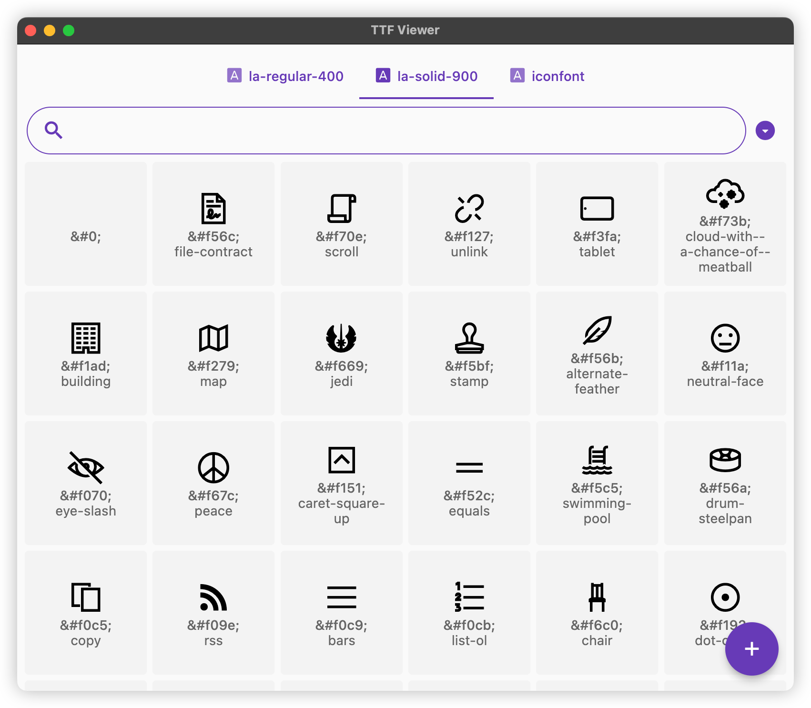
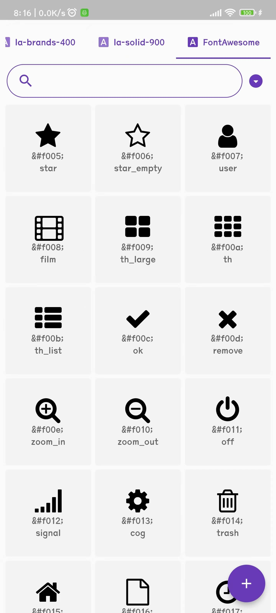
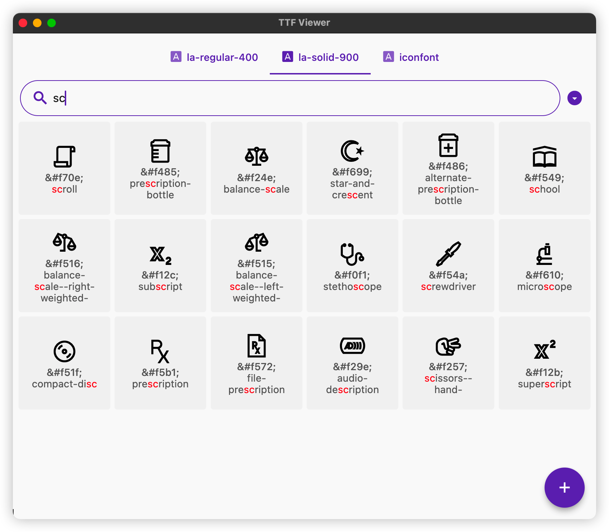
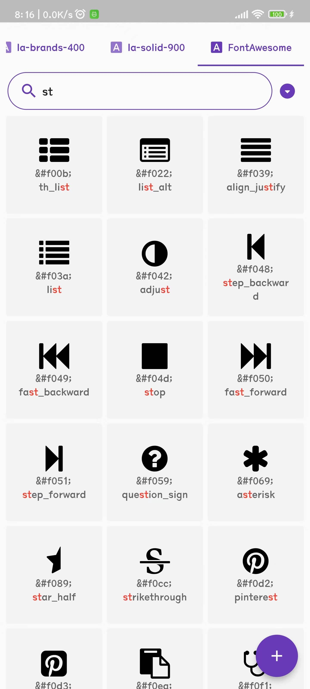
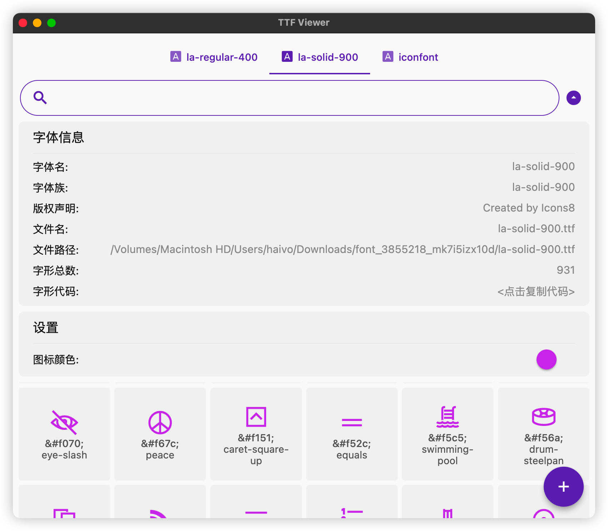
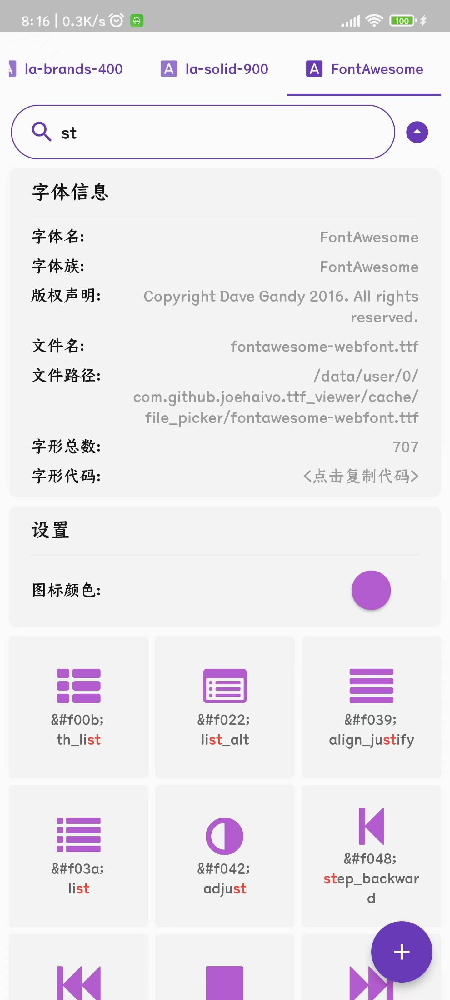

# TTF Viewer

> An open source cross-platform application for browsing the icon of the TrueType font (.ttf) file (usually called iconfont), written by Flutter.

> Language: [简体中文](README.zh_CN.md) [English](README.md)

## 1. Feature

- Support browse icons through drag and drop TTF file into the application window, also supported batch drag and drop. (Except mobile phone)
- Support to open multiple font files at the same time.
- Support to search icon by icon name (glyphName).
- Support copy all glyph code (JSON format) to clipborad, convenient to your programming.
- Support change icon color.
- Support automatic follow-up system language.(English and Chinese)
- Support multi-platform:

| Android | iOS  |                      WEB                      | MacOS | Windows | Linux |
| :-----: | :--: | :-------------------------------------------: | :---: | :-----: | :---: |
|    ✅    |  ⚠️   | ✅ [Go](https://Joehaivo.github.io/ttf_viewer) |   ✅   |    ✅    |   ✅   |

> iOS: Because there are many restrictions on the App Store. You can compile and run it by yourself.


## 2. Screenshot

- Browse icons of ttf file

|  |  |
| ------------------------------------------------------------ | ------------------------------------------------------------ |

- Search icons

|  |  |
| ------------------------------------------------------------ | ------------------------------------------------------------ |


- Font info/Icon color

|  |  |
| ------------------------------------------------------------ | ------------------------------------------------------------ |

  

## 3. Download & Run

- [Online website](https://Joehaivo.github.io/ttf_viewer)

- [Download page](https://github.com/Joehaivo/ttf_viewer/releases)

- [Ttf sample file](doc/iconfont.ttf)

## 4. Compile

> Flutter version: Flutter (Channel stable, 3.3.5), Dart version 2.18.2. running `flutter doctor -v` command to check.

1. clone project

```shell
git clone https://github.com/Joehaivo/ttf_viewer
```

2. move into work directory

```shell
cd ttf_viewer
```

3. List the current support platform

```shell
flutter devices
```

The following information will be printed after running:

> 3 connected devices:
>
> 22041211AC (mobile) • A6I7PNQC8X45WGXK • android-arm64  • Android 13 (API 33)
>
> macOS (desktop)     • macos            • darwin-arm64   • macOS 13.0.1 22A400 darwin-arm
>
> Chrome (web)        • chrome           • web-javascript • Google Chrome 109.0.5414.87

4. Choose to debug and run on the right platform

```shell
flutter run -d 22041211AC # Running on the Android device, '22041211ac' comes from the previous step
# flutter run -d macOS # Running on the macOS device
```

5. package

```shell
flutter build apk --no-tree-shake-icons # Android, product: build/app/outputs/apk/release/app-release.apk
# flutter build macos --no-tree-shake-icons # macOS, product: build/macos/Build/Products/Release/TTF Viewer.app
# fluteer build web # web, product: build/web
# flutter build windows --no-tree-shake-icons # windows 10
# flutter build linux --no-tree-shake-icons # linux only test for Ubuntu 22.04
```

- 5.1 Optional step: package ttf viewer.app into ttf viewer.dmg in macOS platform

```shell
npm install -g appdmg # required 'node' and 'npm' command line tools
cd installers/dmg_creator
appdmg config.json ../../build/macos/Build/Products/Release/TTF\ Viewer.dmg
```
